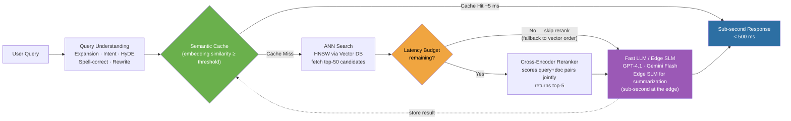

# Retrieval System Architecture

Two-stage design: **ingestion** (offline, scalable throughput) and **query** (online, sub-second latency).

---

## 1. Ingestion Pipeline

```mermaid
flowchart LR
    A["Document Sources\nAPIs / Files / DBs / Crawlers"]
    B[/"Kafka Topic\nraw-documents"/]
    C["Worker Pool\nBatch Consumers\n(horizontally scalable)"]
    D["Text Cleaning\nNormalize · Deduplicate · Chunk"]
    E["Document Expansion\nHyDE · Synonyms · BM25 terms\n(optional — improves recall)"]
    F["Embedding Model\nall-MiniLM / BGE-large / Ada-3"]
    G["Field Filtering\nMetadata Extraction\nPayload Schema"]
    H[("Vector DB\nSolr / Qdrant / Weaviate / Pinecone")]
    I["HNSW Index\nBuilt internally by DB\nANN graph for fast kNN"]

    A --> B
    B --> C
    C --> D
    D --> E
    E --> F
    F --> G
    G --> H
    H --> I

    style B fill:#f0a540,color:#000
    style H fill:#4a90d9,color:#fff
    style I fill:#2d6fa3,color:#fff
```



### Key concepts & improvement levers

| Stage | What it does | How to improve |
|---|---|---|
| **Kafka** | Decouples producers from indexing speed; buffers bursts | Partition by doc type for parallel consumer groups |
| **Worker Pool** | Stateless batch consumers — scale horizontally | Async batching (e.g. 64 docs/batch) to amortize embedding GPU calls |
| **Text Cleaning** | Remove noise, normalize whitespace, dedup | Semantic dedup with MinHash LSH before embedding |
| **Document Expansion** | Append generated questions / synonyms to the doc text | HyDE — generate a hypothetical answer and index it alongside the doc |
| **Embedding Model** | Maps text → dense vector | Larger models (BGE-large, E5-mistral) ↑ quality; quantize (int8) to ↓ memory |
| **HNSW Index** | ANN graph — O(log n) query time | Tune `ef_construction` and `m` at build time; trade index cost for query speed |

---

## 2. Query Pipeline



### Key concepts & improvement levers

| Stage | What it does | How to improve |
|---|---|---|
| **Query Understanding** | Rewrites / expands the raw query before embedding | HyDE: embed a hypothetical answer instead of the raw query — improves recall for short/vague queries |
| **Semantic Cache** | Returns a cached result if a near-identical query was seen recently | Lower threshold → more hits, less freshness; higher threshold → safer, fewer hits |
| **ANN Search (HNSW)** | Approximate kNN — fast because it traverses the pre-built graph | Tune `ef_search` at query time for quality vs. latency tradeoff |
| **Latency Budget Gate** | If embed + cache + ANN consumed too much budget, skip reranker | Prevents tail latency blowout; returns vector-ordered results as fallback |
| **Cross-Encoder Reranker** | Jointly scores query+doc pairs — far more accurate than cosine similarity alone | Use a distilled model (MiniLM); batch all pairs in one forward pass |
| **Fast LLM / Edge SLM** | Generates the final answer from top-k passages | GPT-4.1 for quality; Phi-3-mini / Gemma-2B at the edge for sub-100 ms summarization |

---

## End-to-end latency budget (target: < 500 ms)

```
Query embed            ~15 ms
Cache lookup            ~5 ms
ANN search (HNSW)      ~20 ms
Cross-encoder rerank   ~80 ms   ← skip if budget exceeded
LLM answer            ~200 ms   ← use streaming to show first token fast
──────────────────────────────
Total                 ~320 ms   (happy path)
```

---

## Current codebase vs. production target

| Component | Current (codebase) | Production target |
|---|---|---|
| Queue | — (direct batch load) | Kafka / Pub-Sub |
| Vector DB | ChromaDB (local file) | Qdrant / Weaviate / Solr (distributed) |
| Embedding | all-MiniLM-L6-v2 (384-dim) | BGE-large or domain-fine-tuned |
| Reranker | ms-marco-MiniLM-L-6-v2 | Same family, larger (L-12) for quality |
| Answer generation | — | GPT-4.1 / Edge SLM |
| Cache | In-process SemanticCache | Redis with vector index |
