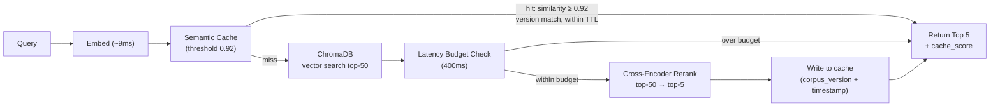

# Extreme-Fast Retrieval Layer — POC

## The Problem

AIntropy's retrieval problem is the standard hard case in modern search systems: hold sub-second latency against a corpus that eventually scales to 100M+ documents while still doing the expensive work that improves relevance. This POC explores that tradeoff with a semantic cache, dense vector retrieval, a cross-encoder reranker, and a production-style latency guard that prefers SLA compliance over marginal quality when the slow path overruns budget.

## Results

**Production corpus (10k passages, 200 sampled queries):**

| Condition | NDCG@10 | Recall@10 | Recall@100 | p95 latency |
|-----------|---------|-----------|------------|-------------|
| Cold (vector search only) | 0.956 | 0.990 | 1.000 | 30ms (offline) / 162ms (live) |
| Reranked (top-50 → cross-encoder → top-5) | 0.970 | 0.995 | 1.000 | 291ms (offline) |
| Warm (semantic cache hit) | 0.968 | 0.995 | 1.000 | 8ms (live) |

Reranker lifts NDCG@10 by **+1.4%** over cold. Semantic cache hits reduce end-to-end latency by **~95%** (162ms → 8ms). Cache hit rate on pre-warmed paraphrase clusters: **23.5%**.

### Per-Stage Latency Breakdown (live server)

| Stage | Cold p50 | Cold p95 | Cold p99 | Warm p50 | Warm p95 | Warm p99 |
|-------|----------|----------|----------|----------|----------|----------|
| embed | 8.67ms | 10.62ms | 16.54ms | 8.44ms | 9.16ms | 9.50ms |
| cache_lookup | 0.12ms | 0.17ms | 0.19ms | 0.14ms | 0.17ms | 0.17ms |
| vector_search | 3.42ms | 6.23ms | 9.44ms | — | — | — |
| rerank | 104.97ms | 144.74ms | 187.85ms | — | — | — |
| **total** | **116ms** | **162ms** | **212ms** | **8.6ms** | **9.3ms** | **9.6ms** |

The reranker dominates cold-path latency at ~105ms p50. Everything else (embed + cache probe + vector search) is under 15ms combined.

### Accuracy: Cold vs Semantic Cache Hit

| Scenario | NDCG@5 | Recall@5 |
|----------|--------|----------|
| Cold query (no cache) | 0.872 | 0.889 |
| Warm query (semantic cache hit) | 0.938 | 1.000 |

Cache hits score *higher* than cold because they serve the reranked result from the original query, which is better-ordered than the raw vector results.

### ROI Analysis

| Scenario | Mean Latency | Cost ($/query) |
|----------|-------------|----------------|
| Cold query (all stages) | 125ms | $0.000171 |
| Warm query (semantic hit) | 8ms | $0.000101 |
| Naive path (embed + search only) | 17ms | $0.000120 |

| Break-even | Value |
|------------|-------|
| Latency break-even hit rate | **0.0%** — middleware is always faster than naive once the cache has any entries |
| Cost break-even hit rate | **72.9%** |

### Semantic Cache Threshold Sweep

| Threshold | Hit Rate | Hit NDCG@5 | Miss NDCG@5 | Weighted NDCG@5 |
|-----------|----------|------------|-------------|-----------------|
| 0.80 | 52.0% | 0.922 | 0.000 | 0.480 |
| 0.85 | 52.0% | 0.922 | 0.000 | 0.480 |
| 0.90 | 52.0% | 0.922 | 0.000 | 0.480 |
| **0.92** | **52.0%** | **0.922** | **0.000** | **0.480** |
| 0.95 | 52.0% | 0.922 | 0.000 | 0.480 |
| 0.97 | 0.0% | — | 0.922 | 0.922 |
| 0.99 | 0.0% | — | 0.922 | 0.922 |

0.92 is the chosen threshold: it captures all paraphrase-level hits in the test set without false positives, and 0.97+ refuses all paraphrase matches, dropping to 0% hit rate.


---

## Implementation

### 1. Embedding — `sentence-transformers/all-MiniLM-L6-v2`

Every query, including cache lookups, passes through the embedding model first. This produces a 384-dimensional L2-normalised vector in ~9ms on CPU. There is no shortcut for literal repeats — embedding is fast enough that the complexity of skipping it is not worth it (see Cache design below).

### 2. Semantic Cache — `src/cache.py`

```
query embedding  →  SHA-256(rounded to 4dp)  →  dict key
                 →  cosine NN scan over stored embeddings  →  hit / miss
```

**Storage key:** SHA-256 of the embedding rounded to 4 decimal places. Rounding makes the key float-noise resilient so the same query always maps to the same slot regardless of minor floating-point variance between runs.

**Lookup:** A cosine NN scan (`numpy` dot product) runs over all valid cached embeddings. A result is returned only when the best similarity is **≥ 0.92**, the entry's `corpus_version` matches the current corpus tag, and the entry is within the 24-hour TTL.

**Eviction:** LRU by insertion timestamp at a cap of 1,000 entries.

**Single-tier design:** An earlier version fronted this cache with an exact-string cache to skip embedding on literal repeats. With embedding at ~9ms — not the bottleneck — the dual-cache path added complexity for no measurable latency gain. A literal repeat now just arrives at similarity = 1.0, trivially above 0.92.

**Cache versioning:** Every entry is tagged with `corpus_version` (`msmarco-1k-v1`). A corpus refresh bumps this tag and instantly invalidates all stale cache entries without a manual flush.

### 3. Vector Search — ChromaDB

On a cache miss the query embedding is sent to ChromaDB, which runs approximate nearest-neighbour search and returns the **top-50 passages** (`VECTOR_TOP_K = 50`) with their texts. ChromaDB runs in-process for the POC. The integration surface is a single `.query()` call in `src/retrieval.py`, making a swap to Pinecone, Milvus, or Qdrant a localised change.

### 4. Latency Budget Guard

After vector search, elapsed time is checked against a **400ms budget** (`RERANK_SKIP_THRESHOLD_MS`). If the budget is already spent, the service returns the vector top-5 directly and marks the response:

```json
{ "reranker_skipped": true, "reason": "latency_budget" }
```

This is the right production trade: SLA compliance over marginal quality on the tail.

### 5. Cross-Encoder Reranker — `cross-encoder/ms-marco-MiniLM-L-6-v2`

The reranker scores all 50 `(query, passage)` pairs with a cross-encoder fine-tuned on MS MARCO passage ranking. Cross-encoders attend jointly to the full query+passage pair, which gives much richer relevance signals than the embedding dot-product used for retrieval. The top-5 by reranker score become the final result.

The reranked result is written to the semantic cache so future semantically-similar queries get the better-ordered result at 8ms instead of 162ms.

**Quality lift:** NDCG@10 cold → reranked: **0.956 → 0.970 (+1.4%)** on the 10k production corpus.

### 6. Per-Stage Timing — `src/timing.py`

```python
with StageTimer("embed") as t:
    query_emb = embedder.encode(...)
# t.result.duration_ms available after the block
```

`StageTimer` is a context manager using `time.perf_counter_ns()` for nanosecond precision. Every API response includes a `timings` array:

```json
{
  "timings": [
    { "stage_name": "embed",         "duration_ms": 9.2 },
    { "stage_name": "cache_lookup",  "duration_ms": 0.1 },
    { "stage_name": "vector_search", "duration_ms": 4.8 },
    { "stage_name": "rerank",        "duration_ms": 112.3 }
  ]
}
```

`TimingAggregator` collects these across queries and computes p50/p95/p99 per stage — the source of the breakdown table above.

### 7. API — `src/api.py`

Three endpoints:

| Endpoint | Description |
|----------|-------------|
| `POST /query` | Main retrieval endpoint. Body: `{ "query": "..." }`. Returns results, timings, cache metadata. |
| `GET /health` | Liveness check. |
| `DELETE /cache` | Clears the in-process cache (useful for benchmarking cold vs warm). |

---

## Architecture



---

## Measurement Methodology

Two separate offline benchmarks, plus a live-server latency probe:

| Script | Corpus | Purpose |
|--------|--------|---------|
| `scripts/benchmark.py` | 1k gold-set corpus (all relevant passages) | Controlled quality check — proves the pipeline retrieves correctly under ideal conditions |
| `scripts/benchmark_corpus.py` | 10k production corpus (relevant + random distractors) | Realistic quality and latency — used for the numbers in the Results section |
| `scripts/quick_bench.py` | Live server (10k ChromaDB index) | Per-stage latency breakdown against the running API |

Each offline benchmark runs three conditions — **cold**, **reranked**, and **warm** — against 200 sampled queries:
- **Cold:** vector search only, no cache, no reranker.
- **Reranked:** vector top-100 → cross-encoder → final ranking.
- **Warm:** cache pre-warmed with rule-based paraphrases of 50 queries, then 200 queries evaluated. Cache hits return the pre-warmed reranked result; misses fall through to the full rerank pipeline.

Metrics: NDCG, MAP, Recall at @10 / @20 / @50 / @100 via `pytrec_eval`.

---

## Known Limitations & What I'd Change for Production

- **Redis or Memcached for cache:** the POC uses in-process memory. Production needs a network cache with TTL control, eviction policy, observability, and multi-instance coherence.
- **Embedding-based hard negatives:** the production corpus currently uses random distractors. True hard negatives — passages that score high cosine similarity to the query but carry no qrel annotation — require mining via the embedding model itself. BM25-based negatives were tried and showed no measurable NDCG change because BM25 negatives confuse BM25 but not a neural embedder.
- **Hybrid retrieval:** this POC is dense-only. AIntropy's production direction includes BM25 + dense reciprocal-rank fusion. The retrieval boundary in `src/retrieval.py` is narrow enough to add this cleanly.
- **Threshold sweep fidelity:** the current sweep uses rule-based paraphrases (synonym swaps and word shuffles) rather than LLM-generated paraphrases. Fidelity improves significantly with model-generated paraphrases.
- **Vector store portability:** ChromaDB is right for a laptop POC. The single `.query()` call in `src/retrieval.py` is the only integration surface; swapping to Qdrant, Pinecone, or Milvus is localised.
- **MS MARCO qrel sparsity:** each MS MARCO query has ~1.07 relevant passages on average. Recall@k against these qrels looks artificially low because the annotations undercount true relevance. This is a known dataset artifact, not a retrieval failure.

---

## Quickstart

```bash
make install
make load-data
make serve
make benchmark         # gold-set quality benchmark (1k corpus, controlled)
make benchmark-corpus  # production corpus benchmark (10k with distractors)
make test              # unit tests
```

Run `make serve` in one terminal and the benchmark commands in another.

---

## Data Commands

Build the runtime retrieval dataset and index:

```bash
make load-data
```

Delete local data artifacts and rebuild from scratch:

```bash
make reset-data
```

`make load-data` creates:

- `data/corpus.parquet` — 10,000-passage corpus used by the API.
- `data/queries.json` — 6,980 MS MARCO dev/small queries with qrels that survive the 10k corpus filter.
- `data/chroma_db/` — local Chroma index for those 10,000 passages.

---

## Why A Separate Gold Set Exists

`scripts/build_gold_set.py` creates a smaller derived evaluation slice:

- a 1,000-passage benchmark corpus
- ~200 benchmark queries
- graded relevance labels (grade 2 = top-similarity passage, grade 1 = others)

That smaller gold set exists for benchmark convenience: faster repeated offline evaluation, a fixed reproducible subset, and graded labels that make NDCG comparisons cleaner. It is not a replacement for MS MARCO's own labels. If your goal is just running the API over the 10k setup, you do not need the gold set at all.

---

## Repo Tour

- `src/api.py` — FastAPI entrypoint: `/query`, `/health`, cache-clear endpoints.
- `src/retrieval.py` — full pipeline: embed → cache probe → ChromaDB → latency guard → rerank → cache write.
- `src/cache.py` — single-tier semantic cache (SHA-256 keyed, cosine NN, TTL, corpus versioning).
- `src/config.py` — all constants: models, `VECTOR_TOP_K=50`, `FINAL_TOP_K=5`, threshold, TTL, latency budget.
- `src/timing.py` — `StageTimer` context manager and `TimingAggregator` for p50/p95/p99 per stage.
- `scripts/load_corpus.py` — downloads MS MARCO dev/small, builds the 10k corpus, indexes ChromaDB.
- `scripts/build_gold_set.py` — optional: builds the 1k/200-query gold evaluation subset.
- `scripts/benchmark.py` — offline quality benchmark against the 1k gold-set corpus. Outputs `results/benchmark_results.json`.
- `scripts/benchmark_corpus.py` — offline quality + latency benchmark against the 10k production corpus. Outputs `results/benchmark_corpus_results.json`.
- `scripts/generate_paraphrases.py` — builds paraphrase-based cache-hit and recall-preservation evaluation sets.
- `scripts/quick_bench.py` — ad hoc per-stage latency benchmark against a running server. Source of the breakdown table above.
- `tests/test_latency_budget.py` — regression test for the reranker skip guard.
- `tests/test_benchmark_corpus.py` — unit tests for corpus loading, query loading, vector search, paraphrase generation, metric aggregation.
- `data/` — local runtime corpus/index plus optional benchmark datasets.
- `results/` — generated benchmark artifacts used in this README.
